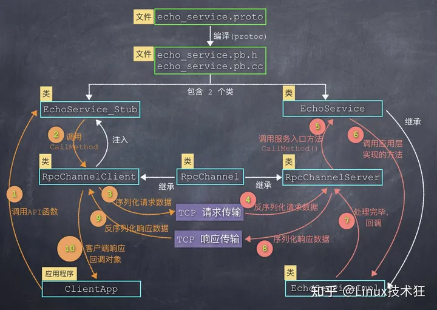

## 本项目实现并改进了Raft共识算法的基本功能，使存储数据库具备线性一致性和分区容错性，在少于半数节点发生故障时仍可正常对外提供服务。

## 实现Raft协议中的心跳、选举、日志提交和快照机制；

Raft协议中的基本功能，详细内容见Raft论文。
https://www.usenix.org/conference/atc14/technical-sessions/presentation/ongaro

### 选举Protobuf RPC
```
message RequestVoteArgs  {
	int32 Term         =1; // 任期号
	int32 CandidateId  =2; // 候选人id
	int32 LastLogIndex =3; // 最新日志索引
	int32 LastLogTerm  =4; // 最新日志任期
}

message RequestVoteReply  {
	int32 Term       =1; // 任期号
	bool VoteGranted =2; // 是否给候选人投票
}
```

### 日志、心跳Protobuf RPC
```
message LogEntry  {
    bytes Command  =1;
	int32 LogTerm  =2;
	int32 LogIndex =3;
}

message AppendEntriesArgs  {
	int32 Term                =1; // 任期号
	int32 LeaderId            =2; // 领导者id
	int32 PrevLogIndex        =3; // 上一个日志索引
	int32 PrevLogTerm         =4; // 上一个日志任期
	repeated LogEntry Entries =5; // 日志（可发多个）
	int32 LeaderCommit        =6; // 已提交的日志索引
}

message AppendEntriesReply {
	int32 Term            =1; // 任期号
	bool Success          =2; // 是否成功
	int32 UpdateNextIndex =3; // 优化日志恢复
	int32 AppState        =4; // 标识节点网络状态
}
```

### 快照Protobuf RPC
```
message InstallSnapshotRequest  {
	int32 LeaderId                 =1; // 领导者id
	int32 Term                     =2; // 任期号
	int32 LastSnapShotIncludeIndex =3; // 上一次快照包括的索引
	int32 LastSnapShotIncludeTerm  =4; // 上一次快照包括的任期
	bytes Data                     =5; // 快照数据
}

message InstallSnapshotResponse  {
	int32 Term =1; // 任期号
}
```

### Raft-KVDB的结构为：raft节点（实现raft功能，和其他节点通信）、raftServer（raft节点的上层管理）、Clerk（客户端，用于连接raftServer以发送命令）、状态机（使用跳表实现的k-v数据库）。


## 优化Follower节点宕机重启后日志恢复的流程；

```
message AppendEntriesReply {
	...
	int32 UpdateNextIndex =3; // 优化日志恢复
	...
}
```

在Raft的回退实现中, 如果有Follower的日志不匹配, 每次RPC中, Leader会将其nextIndex自减1来重试, 但其在某些情况下会导致效率很低, 因此需要AppendEntries RPC的回复信息携带更多的字段以加速回退。

在Follower发现Leader发送的日志和自己不匹配时，回复Success=false的Reply，同时将UpdateNextIndex字段设置为自己下一个日志的索引。Leader在接收这个Reply后，将这个Follower的nextIndex设置为UpdateNextIndex。下一次发送心跳包时，将所有缺失的日志添加进RPC中。

## 实现客户端协议，使用由客户端序号和请求序号组成的请求id以保证线性一致性；

什么时候会出现线形不一致的情况呢？就是重复的请求。

因为网络问题，clerk可能认为之前的请求丢包了，所以会再次发送请求。而raft层是无法判断这个请求是否重复的, 如果server层没有特殊处理, 有的请可能在客户端看来只执行了一次, 但在server执行了多次, 并且如果这是Put等改变状态机的请求, 执行了多次将导致逻辑错误。

实现线性一致性的思路：

如何判断重复请求？这里需要注意的是线性一致性，为了实现这一点，给command递增的index，使用一个map记录每个client最近最后一个被执行command的index以及执行结果，由此可以推测出command序列执行到哪一条了，防止重复执行。

如何处理重复请求？如果是一个重复的Get请求, 其返回的结果应该与其第一次发送请求时一致, 否则将导致线性不一致。如果是重复的Put等改变状态机的请求，就不应该被执行。

## 基于Protobuf实现RPC通信框架；

Step1：创建.proto文件，定义数据结构
Step2：使用protoc工具，编译.proto文档，生成类以及相应的方法
Step3：服务端程序实现接口中定义的方法，提供服务；客户端调用接口函数，调用远程的服务



## 基于跳表实现存储数据库。

### 插入数据
有新数据要插入时，首先在每一层找到最后一个小于新数据的节点，然后创建随机层数的node，将前后指针连起来。
```
                           +------------+
                           |  insert 50 |
                           +------------+
level 4     +-->1+                                                      100
                 |
                 |                      insert +----+
level 3         1+-------->10+---------------> | 50 |          70       100
                                               |    |
                                               |    |
level 2         1          10         30       | 50 |          70       100
                                               |    |
                                               |    |
level 1         1    4     10         30       | 50 |          70       100
                                               |    |
                                               |    |
level 0         1    4   9 10         30   40  | 50 |  60      70       100
                                               +----+
```

从高层开始逐层寻找最后一个小于查询数据的节点，直到找到数据。
```
                           +------------+
                           |  select 60 |
                           +------------+
level 4     +-->1+                                                      100
                 |
                 |
level 3         1+-------->10+------------------>50+           70       100
                                                   |
                                                   |
level 2         1          10         30         50|           70       100
                                                   |
                                                   |
level 1         1    4     10         30         50|           70       100
                                                   |
                                                   |
level 0         1    4   9 10         30   40    50+-->60      70       100
```
